# Olá, eu sou Caio Servulo 👋

### 🚀 Product Manager | Data Product Owner | Estrategista de Produto

Atuo na interseção entre negócios, tecnologia e dados. Minha missão é transformar problemas complexos em produtos escaláveis, sempre guiado por métricas de sucesso e pela experiência do usuário.

---

### 🔍 Sobre Mim

Sou um Product Manager com experiência em análise de dados, growth e customer experience. 

Nos últimos anos, liderei iniciativas de produtos digitais nos setores de fintech, SaaS e varejo, ajudando empresas a desenvolver soluções escaláveis ​​e orientadas a dados que melhoram a eficiência e geram impacto mensurável nos negócios. Minha experiência conecta estratégia, tecnologia e necessidades do cliente. 

Tenho habilidades em descoberta de produtos, metodologias ágeis e Lean, análise de dados (SQL, ferramentas de BI) e colaboração multifuncional.

- 🔭 Atualmente estou trabalhando como Data & Product Manager em uma startup no segmento de gestão empresarial.
- 👯 Procuro interagir e colaborar Comunidades de Produto e Dados.
- 💬 Pergunte-me sobre:
  - Agile
  - Gestão de Backlog
  - Experiência do Usuário
  - OKRs
  - KPIs
  - Análise de Dados
  - SQL
  - Data Viz.

---

### 📁 Cases de Sucesso (Portfólio Detalhado)

Abaixo estão alguns dos desafios que liderei. Você pode acessar a documentação completa de cada case na pasta [`/cases`](./cases).

* **[Case 01: Pandemia e um projeto que virou produto.](./cases/retencao-churn.md)**
    * *Impacto:* Criação de novo produto aumentando o volume de leads captados em 43%.
* **[Case 02: Lançamento de MVP B2B](./cases/mvp-b2b.md)**
    * *Impacto:* Alcançamos o Product-Market Fit em 4 meses com 50 clientes pagantes.
* **[Case 03: Modernização de Pipeline de Dados](./cases/data-pipeline.md)**
    * *Impacto:* Redução de custo de infraestrutura em 30% e democratização de dados.

---

### 🛠️ Toolkit de Produto

| Categoria | Ferramentas / Metodologias |
| :--- | :--- |
| **Gestão & Roadmap** | `Jira`, `Miro`, `Productboard`, `Azure`, `ClickUp`, `Freaturebase` |
| **Análise de Dados** | `SQL`, `Tableau`, `Power BI`, `Python`, `Loker`, `Metabase` |
| **Automação** | `n8n`, `Alteryx` |
| **Frameworks** | `Scrum`, `Kanban`, `Jobs to be Done`, `OKRs`, `KPIs` |

### 📊 Skills & Proficiency

**Product Strategy**
 95%

**Data Analytics**
 90%

**Agile Leadership**
 85%

**Technical Understanding**
 75%

### 📈 Competências Técnicas

```text
Product Vision    █████████████████████████▒ 95%
Data Driven       ███████████████████████▒▒▒ 90%
Stakeholder Mgmt  ████████████████████▒▒▒▒▒ 80%
SQL & ETL         ██████████████████▒▒▒▒▒▒▒ 70%

```

```mermaid
gantt
    title Nível de Especialidade
    dateFormat  X
    axisFormat %
    section Hard Skills
    Product Strategy :active, 0, 95
    Data Analytics :active, 0, 90
    Agile (Scrum/Kanban) :active, 0, 85
    User Research :active, 0, 80
```



---

### 📊 GitHub Stats


[](https://git.io/streak-stats)

---

### 📫 Vamos conectar?

[](https://linkedin.com/in/caioservulo)
[](mailto:caiomelo22@gmail.com)

---

> "Gosto de resolver problemas!"
-->
